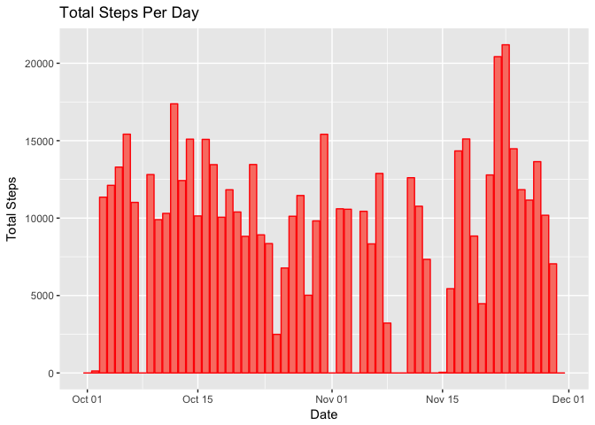
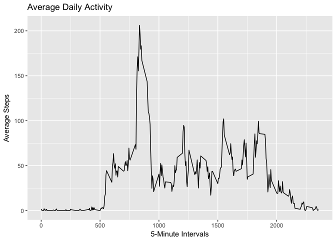
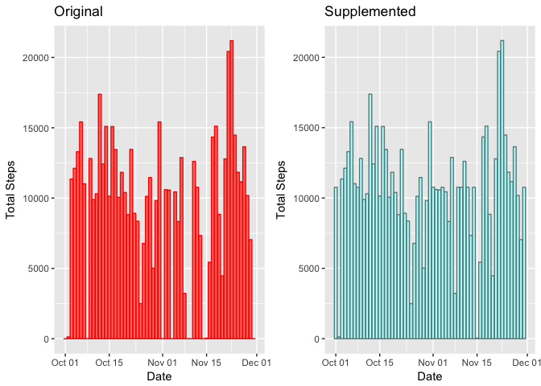
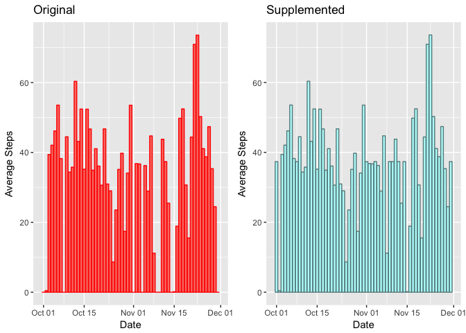
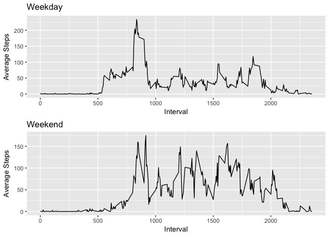

# Reproducible Research: Peer Assessment 1


## Loading and preprocessing the data

* Following libraries are required


```r
library(dplyr)
library(ggplot2)
library(gridExtra)
```

* Load data from dataset


```r
unzip("activity.zip", "activity.csv")
data <- read.csv("activity.csv")
data$date <- as.Date(data$date)
```

## What is mean total number of steps taken per day?

* Calculate average, sum and median for steps per day


```r
activity_by_date <- data %>% 
    group_by(date) %>%
    summarize(Steps.Average = mean(steps, na.rm = TRUE), 
              Steps.Median = median(steps, na.rm = TRUE),
              Steps.Total = sum(steps, na.rm = TRUE)) %>%
    mutate(Steps.Average = ifelse(is.nan(Steps.Average), 0, Steps.Average)) %>%
    mutate(Steps.Median = ifelse(is.na(Steps.Median), 0, Steps.Average))
```

* Histogram for total number of steps per day:


```r
ggplot(activity_by_date, aes(x=date, y=Steps.Total)) + 
    geom_bar(stat = "identity", fill="salmon", colour="red") +
    labs(x = "Date", y = "Total Steps") +
    ggtitle("Total Steps Per Day")
```

<!-- -->

* Mean and median:


```r
activity_by_date %>% select(c(date, Steps.Average, Steps.Median))
```

```
## # A tibble: 61 x 3
##          date Steps.Average Steps.Median
##        <date>         <dbl>        <dbl>
##  1 2012-10-01       0.00000      0.00000
##  2 2012-10-02       0.43750      0.43750
##  3 2012-10-03      39.41667     39.41667
##  4 2012-10-04      42.06944     42.06944
##  5 2012-10-05      46.15972     46.15972
##  6 2012-10-06      53.54167     53.54167
##  7 2012-10-07      38.24653     38.24653
##  8 2012-10-08       0.00000      0.00000
##  9 2012-10-09      44.48264     44.48264
## 10 2012-10-10      34.37500     34.37500
## # ... with 51 more rows
```

## What is the average daily activity pattern?


```r
activity_by_time <- data %>%
    group_by(interval) %>%
    summarize(Steps.Average = mean(steps[!is.na(steps)]))

qplot(interval, Steps.Average, data=activity_by_time, main="Average Daily Activity", xlab="5-Minute Intervals", ylab="Average Steps", geom="line")
```

<!-- -->

## Imputing missing values

Total number of missing values in the dataset


```r
na_rows <- data[!complete.cases(data),]
nrow(na_rows)
```

```
## [1] 2304
```

Filling empty values by average steps for day


```r
data_full <- data
for (i in 1:nrow(activity_by_time)) {
    activity = activity_by_time[i,]
    data_full[is.na(data_full$step) & data_full$interval == activity$interval, 1] <- round(activity$Steps.Average)
}
```

Mean and median values for supplemented dataset


```r
activity_by_date_full <- data_full %>% 
    group_by(date) %>%
    summarize(Steps.Average = mean(steps, na.rm = TRUE), 
              Steps.Median = median(steps, na.rm = TRUE),
              Steps.Total = sum(steps, na.rm = TRUE))
```

Total steps for original and supplemented datasets.


```r
total_original <- ggplot(activity_by_date, aes(x=date, y=Steps.Total)) + 
    geom_bar(stat = "identity", fill="salmon", colour="red") +
    labs(x = "Date", y = "Total Steps") +
    ggtitle("Original")

total_fill = ggplot(activity_by_date_full, aes(x=date, y=Steps.Total)) +
    geom_bar(stat = "identity", fill="paleturquoise1", colour="paleturquoise4") +
    labs(x = "Date", y = "Total Steps") +
    ggtitle("Supplemented")
grid.arrange(total_original, total_fill, ncol=2)
```

<!-- -->

Average steps for original and supplemented datasets.


```r
mean_original <- ggplot(activity_by_date, aes(x=date, y=Steps.Average)) + 
    geom_bar(stat = "identity", fill="salmon", colour="red") +
    labs(x = "Date", y = "Average Steps") +
    ggtitle("Original")

mean_fill = ggplot(activity_by_date_full, aes(x=date, y=Steps.Average)) +
    geom_bar(stat = "identity", fill="paleturquoise1", colour="paleturquoise4") +
    labs(x = "Date", y = "Average Steps") +
    ggtitle("Supplemented")
grid.arrange(mean_original, mean_fill, ncol=2)
```

<!-- -->

Median steps for original and supplemented datasets.


```r
median_original <- ggplot(activity_by_date, aes(x=date, y=Steps.Median)) + 
    geom_bar(stat = "identity", fill="salmon", colour="red") +
    labs(x = "Date", y = "Median Steps") +
    ggtitle("Original")

median_fill = ggplot(activity_by_date_full, aes(x=date, y=Steps.Median)) +
    geom_bar(stat = "identity", fill="paleturquoise1", colour="paleturquoise4") +
    labs(x = "Date", y = "Median Steps") +
    ggtitle("Supplemented")

grid.arrange(median_original, median_fill, ncol=2)
```

<!-- -->

## Are there differences in activity patterns between weekdays and weekends?


```r
data <- data %>% mutate(Day = ifelse(weekdays(date, abbreviate = T) %in% c("Sat", "Sun"), "weekend", "weekday"))
activity_by_time_day <- data %>%
    group_by(interval, Day) %>%
    summarize(Steps.Average = mean(steps[!is.na(steps)]))

weekend_activity <- activity_by_time_day[activity_by_time_day$Day == "weekend",]
weekday_activity <- activity_by_time_day[activity_by_time_day$Day == "weekday",]

steps_weekend <- ggplot(weekend_activity, aes(x=interval, y=Steps.Average)) + 
    geom_line() +
    labs(x = "Interval", y = "Average Steps") +
    ggtitle("Weekend")


steps_weekend <- ggplot(weekend_activity, aes(x=interval, y=Steps.Average)) + 
    geom_line() +
    labs(x = "Interval", y = "Average Steps") +
    ggtitle("Weekend")

steps_weekday <- ggplot(weekday_activity, aes(x=interval, y=Steps.Average)) + 
    geom_line() +
    labs(x = "Interval", y = "Average Steps") +
    ggtitle("Weekday")

grid.arrange(steps_weekday, steps_weekend, nrow=2)
```

<!-- -->
