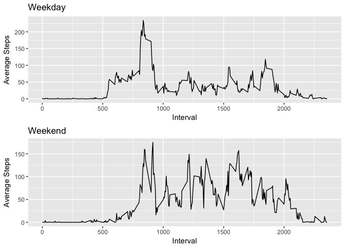

# Reproducible Research: Peer Assessment 1


## Loading and preprocessing the data

* Following libraries are required


```r
library(dplyr)
library(ggplot2)
library(gridExtra)
```

* Load data from dataset


```r
unzip("activity.zip", "activity.csv")
data <- read.csv("activity.csv")
data$date <- as.Date(data$date)
```

## What is mean total number of steps taken per day?

Average, sum and median for steps per day


```r
activity_by_date <- data %>% 
    group_by(date) %>%
    summarize(Steps.Total = sum(steps, na.rm = TRUE))
```

Histogram for total number of steps per day:


```r
ggplot(activity_by_date, aes(x=date, y=Steps.Total)) + 
    geom_histogram(stat = "identity", fill="salmon", colour="red") +
    labs(x = "Date", y = "Total Steps") +
    ggtitle("Total Steps Per Day")
```

```
## Warning: Ignoring unknown parameters: binwidth, bins, pad
```

<!-- -->

Mean total number of steps


```r
mean_original <- mean(activity_by_date$Steps.Total)
mean_original
```

```
## [1] 9354.23
```

Median total number of steps


```r
median_original <- median(activity_by_date$Steps.Total)
median_original
```

```
## [1] 10395
```

## What is the average daily activity pattern?


```r
activity_by_time <- data %>%
    group_by(interval) %>%
    summarize(Steps.Average = mean(steps[!is.na(steps)]))

qplot(interval, Steps.Average, data=activity_by_time, main="Average Daily Activity", xlab="5-Minute Intervals", ylab="Average Steps", geom="line")
```

<!-- -->

Finding time interval with maximum mean number of steps


```r
activity_by_time_sorted <- activity_by_time %>%
    arrange(desc(Steps.Average))
activity_by_time_sorted[1, ]$interval
```

```
## [1] 835
```

## Imputing missing values

Total number of missing values in the dataset


```r
na_rows <- data[!complete.cases(data),]
nrow(na_rows)
```

```
## [1] 2304
```

Empty values are replaced by average number of steps for corresponding interval


```r
data_full <- data
for (i in 1:nrow(activity_by_time)) {
    activity = activity_by_time[i,]
    data_full[is.na(data_full$step) & data_full$interval == activity$interval, 1] <- round(activity$Steps.Average)
}
```

Mean and median values for supplemented dataset


```r
activity_by_date_full <- data_full %>% 
    group_by(date) %>%
    summarize(Steps.Total = sum(steps, na.rm = TRUE))
```

Total steps for original and supplemented datasets.


```r
total_original <- ggplot(activity_by_date, aes(x=date, y=Steps.Total)) + 
    geom_bar(stat = "identity", fill="salmon", colour="red") +
    labs(x = "Date", y = "Total Steps") +
    ggtitle("Original")

total_fill = ggplot(activity_by_date_full, aes(x=date, y=Steps.Total)) +
    geom_bar(stat = "identity", fill="paleturquoise1", colour="paleturquoise4") +
    labs(x = "Date", y = "Total Steps") +
    ggtitle("Supplemented")
grid.arrange(total_original, total_fill, ncol=2)
```

<!-- -->

Average total steps:


```r
mean_full <- mean(activity_by_date_full$Steps.Total)
data.frame(c(mean_full, mean_original), row.names = c("Supplemented", "Original"))
```

```
##              c.mean_full..mean_original.
## Supplemented                    10765.64
## Original                         9354.23
```

Median of total steps:


```r
median_full <- median(activity_by_date_full$Steps.Total)
data.frame(c(median_full, median_original), row.names = c("Supplemented", "Original"))
```

```
##              c.median_full..median_original.
## Supplemented                           10762
## Original                               10395
```

## Are there differences in activity patterns between weekdays and weekends?


```r
data <- data %>% mutate(Day = ifelse(weekdays(date, abbreviate = T) %in% c("Sat", "Sun"), "weekend", "weekday"))
activity_by_time_day <- data %>%
    group_by(interval, Day) %>%
    summarize(Steps.Average = mean(steps[!is.na(steps)]))

weekend_activity <- activity_by_time_day[activity_by_time_day$Day == "weekend",]
weekday_activity <- activity_by_time_day[activity_by_time_day$Day == "weekday",]

steps_weekend <- ggplot(weekend_activity, aes(x=interval, y=Steps.Average)) + 
    geom_line() +
    labs(x = "Interval", y = "Average Steps") +
    ggtitle("Weekend")


steps_weekend <- ggplot(weekend_activity, aes(x=interval, y=Steps.Average)) + 
    geom_line() +
    labs(x = "Interval", y = "Average Steps") +
    ggtitle("Weekend")

steps_weekday <- ggplot(weekday_activity, aes(x=interval, y=Steps.Average)) + 
    geom_line() +
    labs(x = "Interval", y = "Average Steps") +
    ggtitle("Weekday")

grid.arrange(steps_weekday, steps_weekend, nrow=2)
```

<!-- -->
